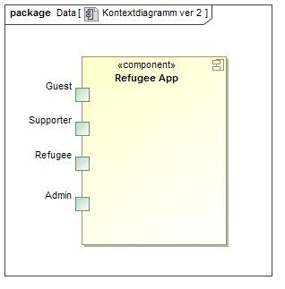
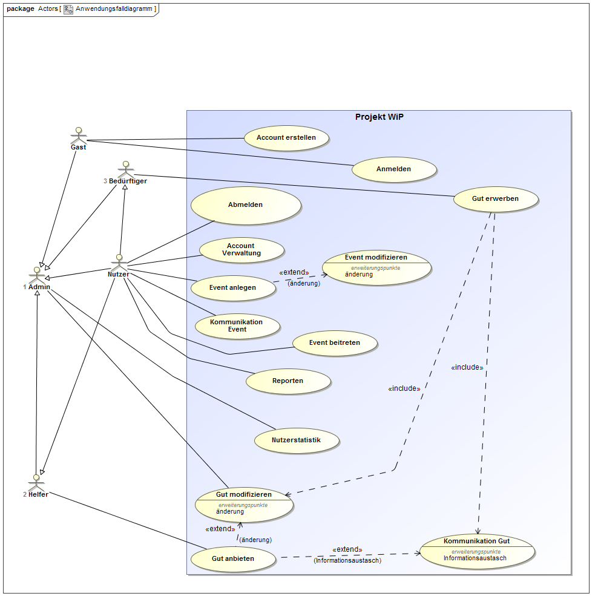
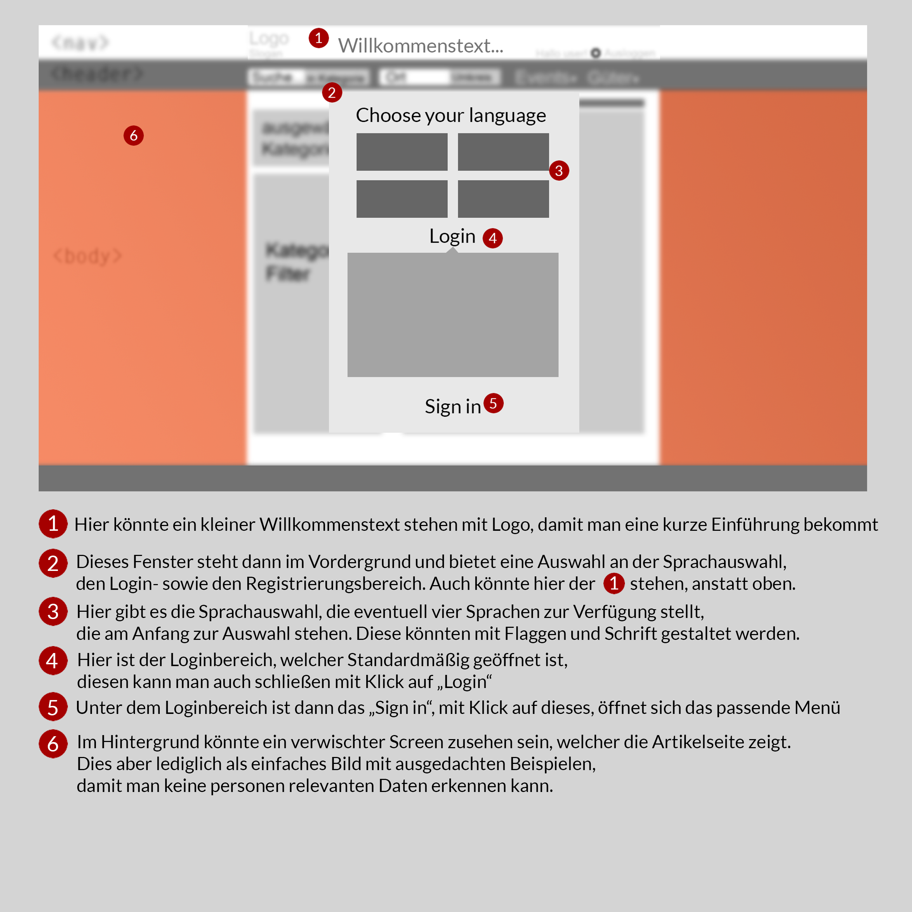
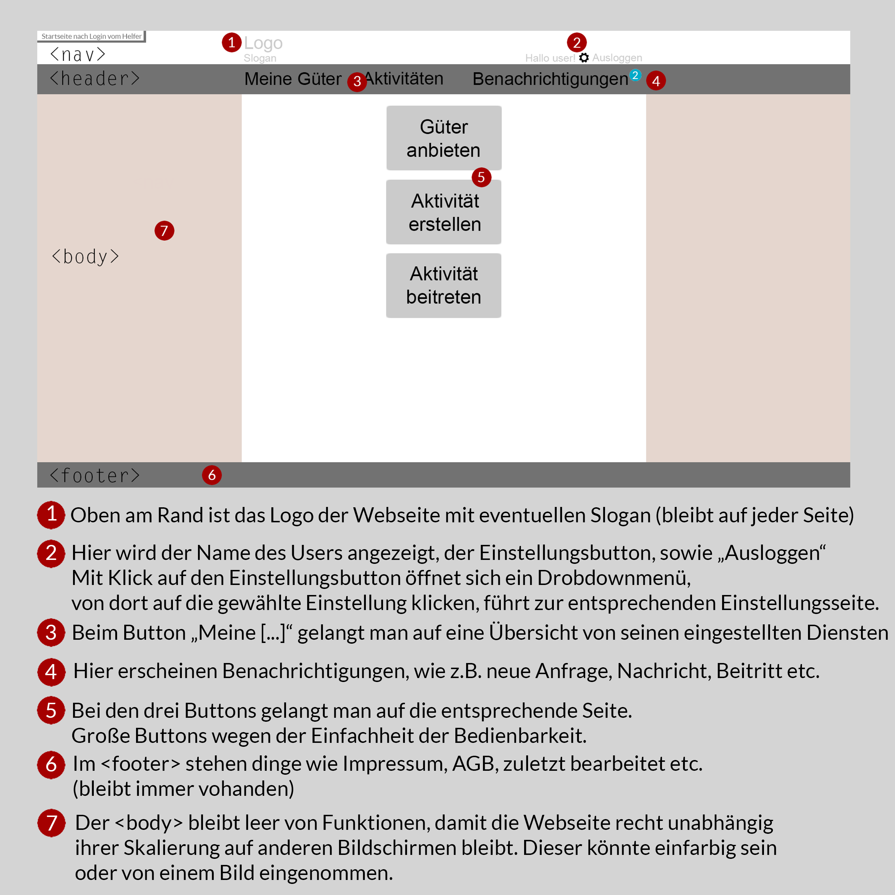
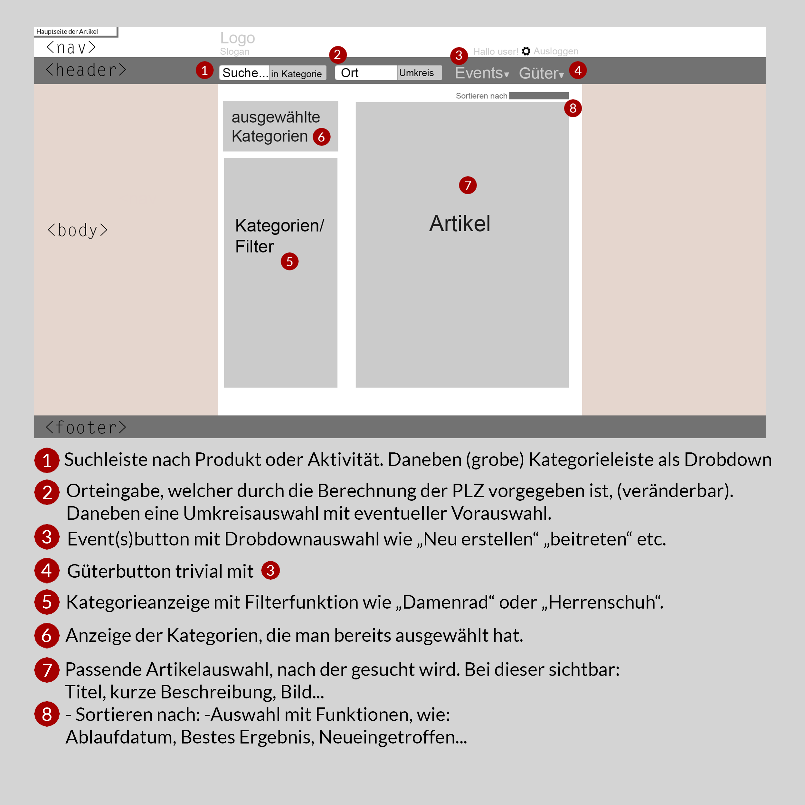
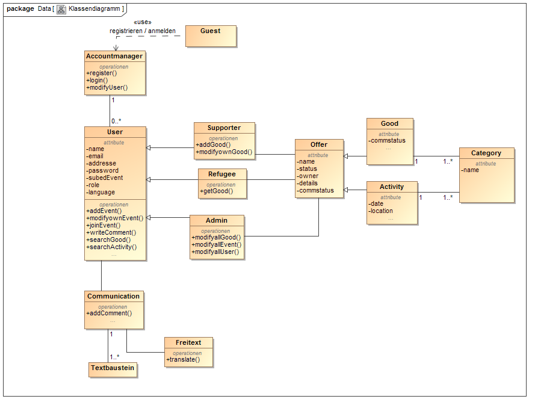

:toc:
:toc-placement!:
:toc-title:

= Pflichtenheft

== Refugee-App (vorläufig)

__Version:__    *1.0.1*

__Status:__     *In Arbeit*

__Stand:__      *27 Oktober 2015*

== Zusammenfassung

[%hardbreaks]
Das Pflichtenheft ist die Grundlage des eigentlichen Projektes. In diesem Dokument findet man die Aufgabenstellung sowie die dazugehörigen Muss- und Kann-Kriterien. Außerdem bietet es einen Überblick in die OOA, sprich die Analyse, in der From von verscheidensten Diagrammen (Kontextdiagramm, Analyseklassendiagram,…). Auch zeigt es eine erste Version der GUI.
Als letztes zählt es die Aktzeptanstesfälle auf, die zum Ende des Projektes erfüllt werden müssen.

== Inhaltsverzeichnis

toc::[]

== Aufgabenstellung und Zielsetzung
=== Aufgabenstellung
Im Rahmen der aktuellen Flüchtlingssituation kann man sich Gedanken machen, wie man diesen vielen Menschen helfen könnte, welche mit rein gar nichts außer den Sachen am eigenen Leibe bei uns ankommen. Wir leben in einer Überflussgesellschaft und ein jeder hat viele Sachen und Dinge, die leicht zu entbehren sind, da diese schon seit Ewigkeiten im Keller oder Boden stehen, welche jedoch den Menschen hier ein menschenwürdiges Leben ermöglichen würden - angefangen von Anzieh- und Spielsachen für Kinder bis hin zu alten Fahrrädern zur Fortbewegung etc.

Natürlich gibt es bereits viele Hilfsorganisationen, welche Hilfsgüter/Sachspenden sammeln und anschließend verteilen, die man hierfür in Anspruch nehmen kann, allerdings wollen auch viele Menschen einfach direkt selbst helfen, entweder einfach nur in dem man die Hilfsgüter bereitstellt/anbietet oder aber vielleicht auch durch Freizeitangebote um Integrationsmöglichkeiten zu schaffen.

Hierbei scheitert es jedoch oft an den Fremdsprachenkenntnisse der Beteiligten und an einer geeigneten Plattform, um überhaupt erst in Kontakt treten zu können. Was uns daher vorschwebt ist eine Art eBay-Kleinanzeigen Portal allerdings multi-lingual - ein Art Welcome- Refugee - Portal, wo Menschen mittels einer Textbaustein-dialog-prinzip und mit Unterstützung von Google Translate in der eigenen Landsprache mit Menschen jeglicher Nationen einfach und unkompliziert in Kontakt treten können, damit so einfach Dinge schnell und unkompliziert direkt ohne Umwege über Sammellager von DRK etc. den Weg zu Bedürftigen finden können. Die Plattform soll aber nicht nur ausschließlich dem Austausch von Gegenständen dienen, sondern auch die Möglichkeit bieten, Angebote zur schnellen Integration der Flüchtlingen bei uns anzubieten z.B. durch das Annoncieren von Deutschkursen etc.

=== Zielsetzung
Ziel diese Projektes ist es zum einen einen Sinnvollen beitrag zu der aktuellen Flüchtlingssituation zu leisten zum anderen soll es den Studenten ermöglichen das theoretisch gelernte Wissen der Vorlesung Softwaretechnologie praktisch anzuwenden, mit Frameworks und Tools zu arbeiten, die Ihnen im zukünftigen Arbeitsleben hilfreich sein könnten und Ihnen einen Überblick zu verschaffen, wie es sein könnte in dem Themenbereich Informatik später zu arbeiten.

== Fachlicher Überblick
Einleitung für fachfremde Personen

Dieses Projekt entsteht im Zuge eines Pflichtmodules für Informatiker an der TU Dresden. Dieses baut auf dem Modul Softwaretechnologie auf, welches die Grundlagen für die Entwicklung von Java-Applikationen zum Thema hatte. Die Hauptprogrammiersprche ist deshalb Java. Zusätzlich zu der Progammiersprache wurden auch das Spring- und Salespointframework vorgegeben, letzers wird an der TU Dresden entwickelt.
Speziel dieses Projekt jedoch ist jedoch eine kleine Besonderheit, da es nach Fertigstellung eventuell veröffentlicht wird. Auch ist es keine, für diese Art von Projekten, typische Aufgabe, weswegen die Verwendung weiterer Frameworks unabdingbar ist.

== Systemgrenze und Top-Level-Architektur

=== Kontextdiagramm
Das Kontextdiagramm zeigt das geplante Software-System in seiner Umgebung. Zur Umgebung gehören alle Nutzergruppen des Systems und Nachbarsysteme. Die Grafik kann auch informell gehalten sein. Überlegen Sie sich dann geeignete Symbole. Die Grafik kann beispielsweise mit Visio erstellt werden. Wenn nötig, erläutern Sie diese Grafik.

=== Top-level architecture
Dokumentieren Sie ihre Top-Level-Architektur mit Hilfe eines Komponentendiagramm.

== Anwendungsfälle

=== Überblick Anwendungsfalldiagramm
Anwendungsfall-Diagramm, das alle Anwendungsfälle und alle Akteure darstellt

=== Akteure

Akteure sind die Benutzer des Software-Systems oder Nachbarsysteme, welche darauf zugreifen. Dokumentieren Sie die Akteure in einer Tabelle. Diese Tabelle gibt einen Überblick über die Akteure und beschreibt sie kurz. Die Tabelle hat also mindestens zwei Spalten (Akteur Name und Kommentar).

// See http://asciidoctor.org/docs/user-manual/#tables
[options="header"]
|===
|Name 		 |Beschreibung																													  
|Gast 		 |User der die Website aufruft und sich noch nicht regestriert bzw angemeldet hat											  
|Nutzer 	 |User der sich bereits auf der Website regestriert und angemeldet hat, Zugang zu der Accountverwaltung und den Events		 	  
|Helfer 	 |Selben Rechte wie der Nutzer, zusätzlich erlaubt Güter einzustellen 															  
|Bedürftiger |Selben Rechte wie der Nutzer, zusätzlich erlaubt Güter zu erwerben 															  
|Admin 		 |Selben Rechte wie jeder andere Akteur, zusätlich kann er Güter und Events modifizieren ohne sie vorher selber erstellt zu haben 
|===

=== Anwendungsfallbeschreibungen
Dieser Unterabschnitt beschreibt die Anwendungsfälle. In dieser Beschreibung müssen noch nicht alle Sonderfälle und Varianten berücksichtigt werden. Schwerpunkt ist es, die wichtigsten Anwendungsfälle des Systems zu finden. Wichtig sind solche Anwendungsfälle, die für den Auftraggeber, den Nutzer den größten Nutzen bringen.
Für komplexere Anwendungsfälle ein UML-Sequenzdiagramm ergänzen.
Einfache Anwendungsfälle mit einem Absatz beschreiben.
Die typischen Anwendungsfälle (Anlegen, Ändern, Löschen) können zu einem einzigen zusammengefasst werden.

[options="header"]
|===
|Anwendungsfall
|Dem Gast wird es ermöglicht ein Konto zu erstellen und anzumelden
|Ein Nutzer von der Rolle "Supporter" kann ein Good einstellen, dieses Good wird durch einen Namen, eine Beschreibung (verschiedene Attribute) und Kategorien beschrieben
|Nutzer (egal ob Supporter oder Refugee) können Activities anlegen, eine Activity wird durch einen Namen und eine Beschreibung (zb. Datum, Ort und eine tasächliche Beschreibung) beschrieben
|Ein Nutzer von der Rolle "Refugee" kann nach verschiedenen Goods suchen, zum einen direkt mithilfe einer Suche, zum anderen mithilfe von verschiedenen Kategorien; er kann sich auch für eins (odere mehrer) Good(s) "interessieren" und mit dem zu dem Good gehörenden Supporter kontakt aufnehmen  
|Nuzer (egal ob Supporter oder Refugee) können Activities suchen, direkt und mithilfe von Kategorien; Nutzer können sich für eine Activity anmelden
|…
|===

== Anforderungen

=== Muss-Kriterien
Was das zu erstellende Programm auf alle Fälle leisten muss.

* Nutzermanagement
** Erstellen / Löschen / Modifizieren
*** User nur sich selbst
*** Admin alle
** Rollen (min. User und Admin)
* Kategorien
** Einteilung / Tagging der Güter und Events
** Vordefinierte Liste an Kategorien
* Item Management (Güter und Events)
** Erstellen / Löschen / Bearbeiten (User nur eigene, Admin alle)
* Dialoge
** Tracking von Dialog Fortschritt
** Dialogbausteine
** Priorisierung (Antworten auf zuletzt gewählte Bausteine zuerst)
** Dynamische Verknüpfung der Bausteine (mit verschiedenen entry points je nach Kontext)
** Modifikation via JSON upload (nicht zwingen notwendig, wenn per GUI implementiert, könnte aber für die GUI das backend sein)
* Struktur
** Güter
*** Übersicht
*** Suche
*** Abhängikeit von der DIstanz (erwünschte Maximaldistanz sollte einstellbar sein)
*** Anzeige
**** Foto hochladen
**** Vordefinierte Attributsliste
** Events
*** Übesicht
*** Suche
*** Anzeige
** Mehrsprachiges Interface

=== Kann-Kriterien
Anforderungen die das Programm leisten können soll, aber für den korrekten Betrieb entbehrlich sind.

* Erstellen / Löschen / Bearbeiten neuer Kategorien
* Dialog + Management
** Dialog Management
*** Neue Satzfragmente (GUI)
*** Satzfragmente bearbeiten (GUI)
*** Vorschläge und Zusammenhänge modifizieren (GUI)
** Dialog
*** Preference based sorting
*** Tagging und Kategorisierung
*** Chatsystem
* Auflösung / Schließen von Events nach Datum
* Periodische Wiederholung von Events
* Editierbare Übersetzung des Interfaces
* Güteranfragen stellen 
* Security
** Feedback zu Nutzern
*** Report-System (Vulgarität/Weiterverkauf für geld etc…)
*** Bewertungs-System
**** Hat der Käufer/Verkäufer gemacht was er versprochen hat?
** Wegwerf E-Mail Addressen blockieren
* Statistik

== GUI Prototyp

=== Überblick: Dialoglandkarte
Erstellen Sie ein Übersichtsdiagramm, das das Zusammenspiel Ihrer Masken zur Laufzeit darstellt. Also mit welchen Aktionen zwischen den Masken navigiert wird. Die nachfolgende Abbildung zeigt eine an die Pinnwand gezeichnete Dialoglandkarte. Ihre Karte sollte zusätzlich die Buttons/Funktionen darstellen, mit deren Hilfe Sie zwischen den Masken navigieren.

=== Dialogbeschreibung

Die Mockups stellen lediglich drei Seiten dar, da die anderen meist selbsterklärend sind. So zum Beispiel ist die Seite von einem Refugee ähnlich wie diese von dem Supporter. So ist auch die Aktivitätenübersicht ähnlich aufgebaut wie die Güterübersicht.
Außerdem wird es voraussichtlich eine Einstellungseite geben, in dem der User seine persönlichen Einstellungen vornehmen kann. 

Farben sowie Schriftarten sind noch nicht explizit geklärt. Bei den Farben wird es eine neutrale Farbe werden, die freundlich wirkt und nicht überladend, z.B. ein Orange oder Grün als Farbverlauf würde passen.
Die Schrift sollte klar erkennbar sein und einfach zu lesen, somit auch keine Serifen, da wir nur kurze Texte haben und prägnante Wörter.

== Datenmodell

=== Überblick: Klassendiagramm
UML-Analyseklassendiagramm

=== Klassen und Enumerationen
Dieser Abschnitt stellt eine Vereinigung von Glossar und der Beschreibung von Klassen/Enumerationen dar. Jede Klasse und Enumeration wird in Form eines Glossars textuell beschrieben. Zusätzlich werden eventuellen Konsistenz- und Formatierungsregeln aufgeführt.

// See http://asciidoctor.org/docs/user-manual/#tables
[options="header"]
|===
|Klasse/Enumeration |Beschreibung
|User			|Klasse die den grundlegenden Nutzer beschreibt, von ihr erben andere Klassen wie Supporter, Admin,…
|Supporter		|Klasse für den User "Supporter", erbt von Nutzer, zusätlich noch addGut() und modifyGut()
|Refugee		|Klasse für den Refugee
|Guest			|Klasse für den Gast, kann sich auf der Seite registrieren und anmelden
|Accountmanager	|Klasse für den Accountmanager, erlaubt die modifikation eines existierenden Useres
|Good			|Beschreibt wie ein Gut genaz aussieht
|Activity		|Beschreibt wie ein Event genau aussieht
|Offer			|Beschreibt grundlegen wie ein Event bzw Gut aussieht
|Category		|Klasse für die verschiedenen Kategorien der Güter
|Communication	|Klasse für die Kommunikation
|Freitext		|Klasse für den Freitextaspekt der Communication
|Textbaustein	|Klasse für den Textbausteinaspekt der Communication
|===

== Aktzeptanztestfälle
Mithilfe von Akzeptanztests wird geprüft, ob die Software die funktionalen Erwartungen und Anforderungen im Gebrauch erfüllt. Diese sollen und können aus den Anwendungsfallbeschreibungen und den UML-Sequenzdiagrammen abgeleitet werden. D.h., pro (komplexen) Anwendungsfall gibt es typischerweise mindestens ein Sequenzdiagramm (welches ein Szenarium beschreibt). Für jedes Szenarium sollte es einen Akzeptanztestfall geben. Listen Sie alle Akzeptanztestfälle in tabellarischer Form auf.
Jeder Testfall soll mit einer ID versehen werde, um später zwischen den Dokumenten (z.B. im Test-Plan) referenzieren zu können.

//See http://asciidoctor.org/docs/user-manual/#tables
[options="header"]
|===
|ID |Akzeptanztestfall
|1 	|Gast kann Account erstellen
|2	|Gast kann sich Einloggen
|3	|User kann eigenes Konto bearbeiten und löschen
|4	|Admin kann alle Konten bearbeiten und löschen
|5	|Supporter kann Good anlegen
|6	|Supporter kann eigene Goods bearbeiten und löschen
|7	|Admin kann alle Goods bearbeiten und löschen
|8	|User kann Activities anlegen
|9	|User kann eigenes Activities bearbeiten und löschen
|	|User kann Activity beitreten
|10	|Admin kann alle Activities bearbeiten und löschen
|11	|Refugee kann Good "erwerben"
|12	|…
|…	|…  
|===

== Offene Punkte
Offene Punkte werden entweder direkt in der Spezifikation notiert. Wenn das Pflichtenheft  zum finalen Review vorgelegt wird, sollte es keine offenen Punkte mehr geben.

=== Offene Punkte bis zur Version 1.1
* [x] Inhaltsverzeichnis optimieren
* [x] Aufgabenstllung
* [x] Zielsetzung
* [x] Fachlicher Überblick
* [ ] Systemgrenze und Top-Level-Architektur
** [x] Kontextdiagramm
** [ ] Top-Level-Architektur
* [x] Anwendungsfälle
** [x] Überblick Anwendungsfalldiagramm
** [x] Akteure
** [x] Anwendungsfallbeschreibungen
* [x] Anforderungen
** [x] Muss-Kriterien
** [x] Kann-Kriterien
* [x] GUI Prototyp
** [x] Überblick: Dialoglandkarte
** [x] Dialogbeschreibung
* [x] Datenmodell
** [x] Überblick: Klassendiagramm
** [x] Klassen und Enumeration
* [x] Aktzeptanstesfälle
* [x] Bezeichnung (zB.Bedürftiger klingt nicht schön)
